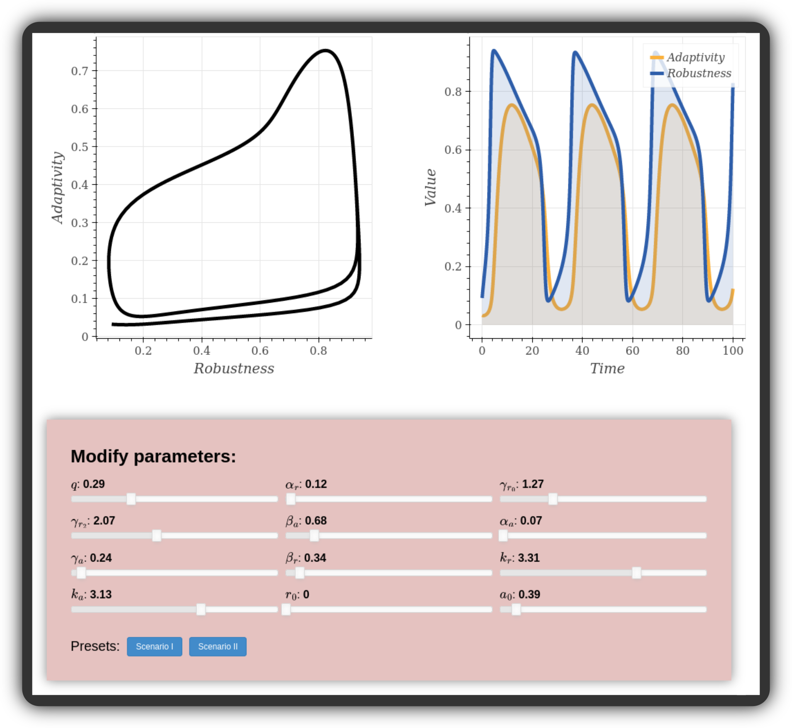

# Resilience Lifecycle Dashboard

This repository contains an interactive dashboard that visualizes the cycles emerging from the resilience model presented in the paper "Struggling with change: The fragile resilience of collectives".

The dashboard lets users see the effect of parameter changes on the cycles.
The dashboard offers sliders that allow the user to interactively change each parameter and immediately see the effect on the cycles.

The dashboard is programmed in Python and JavaScript using the [Bokeh](https://github.com/bokeh/bokeh) visualization library.
The code in this repository compiles the dashboard as an HTML website, which can then be viewed in standard web browsers.
The dashboard performs all computations inside the user's browser without a backend server.
An online version of the dashboard can be viewed [here](https://www.sg.ethz.ch/extra/cz/resilience_dashboard/).

## Usage

To generate the dashboard and view it, you can proceed as follows in a `bash` terminal:

1. Clone this repository, and install all Python packages from `requirements.txt`.
2. Type: `cd /path/to/repository`
3. Type: `cd dashboard/`
4. Type: `python dashboard.py`
5. This generates a file `dashboard.html` in the same directory, which you can now open in your browser.
